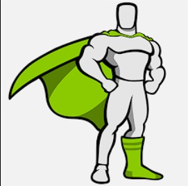
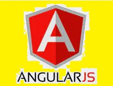

<!DOCTYPE html>
<html lang="en">
<head>
    <meta charset="UTF-8">
    <meta http-equiv="X-UA-Compatible" content="IE=edge">
    <meta name="viewport" content="width=device-width, initial-scale=1.0">
    <title>Presentación y Conocimientos Generales</title>
    
    <link rel="stylesheet" href="CSS/PCG.CSS" type="text/CSS">
    <link rel="icon" href="Imágenes/favicon.ico"/>
</head>
<body>
    <header class="ResoluciónYEncabezado">
        

            
            <video src="Vídeos/VideoDeFondo.mp4" autoplay></video>
            
            

                
            

            

                <b>Omar Aguilar Dávila</b>
            

            

                <em>Considero que sé lo necesario
                 
                en cuanto a FrontEnd se refiere
                 
                Pero también quiero ser BackEnd
                 
                Para ser FullStack Developer</em>
            

            

                <a href="https://github.com/0marJ0asAD?tab=repositories" target="_blank">Subiré más contenido A GitHub por si es el interés</a>
            

            

                <b>Mis Conocimientos Principales
                 
                Son los Siguientes:</b>
            

            

                
                

                    <b>HTML5</b>
                     
                    
                

                

                    <b>CSS3</b>
                     
                    
                

                

                    <b>JavaScript</b>
                     
                    
                

                

                    <b>Python</b>
                     
                    
                

            

            <h1 id="FrameWorks-Desktop">FrameWorks</h1>

            

                

                    

                        <b>GSAP</b>
                         
                        
                    

                    

                        <b>React-JS</b>
                         
                        
                    

                    

                        <b>SASS</b>
                         
                        
                    

                

                

                    <b>Developer
                     
                    FrontEnd</b>
                     
                    
                

                

                    <b>Mi Nivel de Inglés
                     
                    lo considero decente
                     
                    creo yo, pero cada quién.</b>
                     
                    
                

            

        

        

            <video class="VideoDeFondo" src="Vídeos/VideoDeFondo.mp4" autoplay></video>
            
            

                
            

            

                <b>Omar Aguilar Dávila</b>
            

            

                <em>Considero que sé lo necesario
                 
                en cuanto a FrontEnd se refiere
                 
                Pero también quiero ser BackEnd
                 
                Para ser FullStack Developer</em>
            

            

                <a href="https://github.com/0marJ0asAD?tab=repositories" target="_blank">Subiré más contenido A GitHub por si es el interés</a>
            

            

                <b>Mis Conocimientos Principales
                 
                Son los Siguientes:</b>
            

            

                
                

                    <b>HTML5</b>
                     
                    
                

                

                    <b>CSS3</b>
                     
                    
                

                

                    <b>JavaScript</b>
                     
                    
                

                

                    <b>Python</b>
                     
                    
                

            

            <b id="FrameWorks-Tablet">FrameWorks</b>

            

                

                    <b>GSAP</b>
                     
                    
                

                

                    <b>Angular-JS</b>
                     
                    
                

                

                    <b>SASS</b>
                     
                    
                

            

            

                <b>Developer
                 
                FrontEnd</b>
                 
                
            

            

                <b id="TextoEnglish">Mi Nivel de Inglés lo considero
                 
                decente creo yo, pero cada quién.</b>
                 
                
            

        
        

        

            
            <video id="VideoDeFondo-Móvil" src="Vídeos/VideoDeFondo.mp4" autoplay></video>

            

                
            

            

                <b>Omar Aguilar Dávila</b>
            

            

                <em>Considero que sé lo necesario
                 
                en cuanto a FrontEnd se refiere
                 
                Pero también quiero ser BackEnd
                 
                Para ser FullStack Developer</em>
            

            

                <a href="https://github.com/0marJ0asAD?tab=repositories" target="_blank">Subiré más contenido A GitHub por si es el interés</a>
            

            

                <b>Mis conocimientos Principales son los</b>
                 
                <b>siguientes:</b>
            

            

                

                    <b>HTML</b>
                     
                    
                

                

                    <b>CSS</b>
                     
                    
                

                

                    <b>JavaScript</b>
                     
                    
                

                

                    <b>Python</b>
                     
                    
                

            

            

                

                    <em>GSAP</em>
                     
                    
                

                

                    <em>Angular</em>
                     
                    
                

                

                    <em>SASS</em>
                     
                    
                

            

            

                <em>Developer FrontEnd</em>
                 
                
            

        
        

    </header>

</body>
</html>
